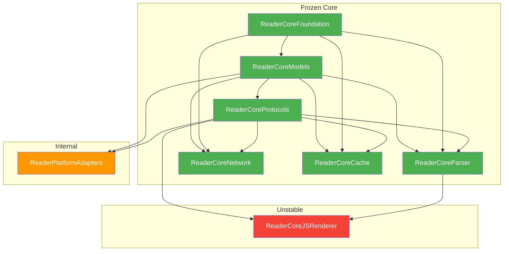

# Core Module Dependency Graph

```yaml
version: "1.0.0"
generatedAt: "2026-04-11"
baseline: "Reader-Core freeze gate CI VERIFIED (run 24279408481)"
source: "Core/Package.swift (swift-tools-version 5.9)"
scope: "frozen_baseline_snapshot"
```

---

## Module List

| # | Module | Type | Boundary |
|---|--------|------|----------|
| 1 | ReaderCoreFoundation | library | frozen |
| 2 | ReaderCoreModels | library | frozen |
| 3 | ReaderCoreProtocols | library | frozen |
| 4 | ReaderCoreParser | library | frozen |
| 5 | ReaderCoreNetwork | library | frozen |
| 6 | ReaderCoreCache | library | frozen |
| 7 | ReaderCoreJSRenderer | library | unstable |
| 8 | ReaderPlatformAdapters | library | internal |

### Executable Targets (not libraries)

| # | Target | Type | Dependencies |
|---|--------|------|--------------|
| 9 | FixtureTocRegressionCLI | executable | ReaderCoreParser |
| 10 | Sample001NonJSSmokeRunner | executable | ReaderCoreModels, ReaderCoreParser |
| 11 | Sample002NonJSSmokeRunner | executable | ReaderCoreModels, ReaderCoreParser |
| 12 | Sample003NonJSSmokeRunner | executable | ReaderCoreModels, ReaderCoreParser |
| 13 | Sample004NonJSSmokeRunner | executable | ReaderCoreModels, ReaderCoreParser |
| 14 | Sample005NonJSSmokeRunner | executable | ReaderCoreModels, ReaderCoreParser |
| 15 | SampleCookie001FetchRunner | executable | ReaderCoreModels, ReaderCoreNetwork, ReaderCoreProtocols, ReaderPlatformAdapters |
| 16 | SampleCookie001IsolationRunner | executable | ReaderCoreModels, ReaderCoreNetwork, ReaderCoreProtocols, ReaderPlatformAdapters |
| 17 | SampleCookie002FetchRunner | executable | ReaderCoreModels, ReaderCoreNetwork, ReaderCoreProtocols, ReaderPlatformAdapters |
| 18 | SampleCookie002IsolationRunner | executable | ReaderCoreModels, ReaderCoreNetwork, ReaderCoreProtocols, ReaderPlatformAdapters |
| 19 | SampleLogin001FetchRunner | executable | ReaderCoreModels, ReaderCoreNetwork, ReaderCoreProtocols, ReaderPlatformAdapters |
| 20 | SampleLogin001IsolationRunner | executable | ReaderCoreModels, ReaderCoreNetwork, ReaderCoreProtocols, ReaderPlatformAdapters |
| 21 | SampleLogin002FetchRunner | executable | ReaderCoreModels, ReaderCoreNetwork, ReaderCoreProtocols, ReaderCoreFoundation, ReaderPlatformAdapters |
| 22 | SampleLogin002IsolationRunner | executable | ReaderCoreModels, ReaderCoreNetwork, ReaderCoreProtocols, ReaderCoreFoundation, ReaderPlatformAdapters |
| 23 | SampleLogin003FetchRunner | executable | ReaderCoreModels, ReaderCoreNetwork, ReaderCoreProtocols, ReaderCoreFoundation, ReaderPlatformAdapters |
| 24 | SampleLogin003IsolationRunner | executable | ReaderCoreModels, ReaderCoreNetwork, ReaderCoreProtocols, ReaderCoreFoundation, ReaderPlatformAdapters |
| 25 | AutoSampleExtractorRunner | executable | ReaderCoreModels, ReaderCoreProtocols, ReaderPlatformAdapters |

### Test Targets

| # | Target | Dependencies |
|---|--------|--------------|
| 26 | ReaderCoreModelsTests | ReaderCoreModels |
| 27 | ReaderCoreParserTests | ReaderCoreParser, ReaderCoreModels, ReaderCoreJSRenderer |
| 28 | ReaderCoreNetworkTests | ReaderCoreNetwork, ReaderCoreModels, ReaderCoreProtocols, ReaderPlatformAdapters |
| 29 | ReaderCoreCacheTests | ReaderCoreCache, ReaderCoreModels, ReaderCoreProtocols |
| 30 | ReaderPlatformAdaptersTests | ReaderPlatformAdapters, ReaderCoreParser, ReaderCoreModels, ReaderCoreProtocols |
| 31 | ReaderCoreJSRendererTests | ReaderCoreJSRenderer |

---

## Dependency Graph (Mermaid)



---

## Dependency Matrix (YAML)

```yaml
dependencies:
  ReaderCoreFoundation:
    depends_on: []
    depended_by: [ReaderCoreModels, ReaderCoreParser, ReaderCoreNetwork, ReaderCoreCache]
    boundary: frozen
    role: "Primitive types (JSONValue). Leaf node. Zero incoming deps."

  ReaderCoreModels:
    depends_on: [ReaderCoreFoundation]
    depended_by: [ReaderCoreProtocols, ReaderCoreParser, ReaderCoreNetwork, ReaderCoreCache, ReaderPlatformAdapters]
    boundary: frozen
    role: "Data models, error types, compatibility types. Single dep on Foundation."

  ReaderCoreProtocols:
    depends_on: [ReaderCoreModels]
    depended_by: [ReaderCoreParser, ReaderCoreNetwork, ReaderCoreCache, ReaderCoreJSRenderer, ReaderPlatformAdapters]
    boundary: frozen
    role: "Protocol contracts. Central seam for dependency inversion. Most depended-on module."

  ReaderCoreParser:
    depends_on: [ReaderCoreModels, ReaderCoreProtocols, ReaderCoreFoundation]
    depended_by: [ReaderCoreJSRenderer]
    boundary: frozen
    role: "CSS/HTML parsing, rule evaluation. Core search/toc/content parsing pipeline."

  ReaderCoreNetwork:
    depends_on: [ReaderCoreModels, ReaderCoreProtocols, ReaderCoreFoundation]
    depended_by: []
    boundary: frozen
    role: "Network policy layer, cookie jar, request building, login bootstrap, response cache."

  ReaderCoreCache:
    depends_on: [ReaderCoreModels, ReaderCoreProtocols, ReaderCoreFoundation]
    depended_by: []
    boundary: frozen
    role: "Minimal HTTP response caching. Decorator over HTTPClient."

  ReaderCoreJSRenderer:
    depends_on: [ReaderCoreParser, ReaderCoreProtocols]
    depended_by: []
    boundary: unstable
    role: "JS DOM bridge. Isolation contract: must not be imported by Parser or Network."

  ReaderPlatformAdapters:
    depends_on: [ReaderCoreProtocols, ReaderCoreModels]
    depended_by: []
    boundary: internal
    role: "Platform-specific adapter implementations. Replaced per-target."
```

---

## Layer Diagram

```
┌─────────────────────────────────────────────────────────┐
│                    Shell / App Layer                     │
│          (iOS, Android, Windows, CLI runners)            │
├─────────────────────────────────────────────────────────┤
│              ReaderPlatformAdapters (internal)           │
│    URLSessionHTTPClient · MinimalHTTPAdapter · Factory    │
├─────────────────────────────────────────────────────────┤
│  ReaderCoreJSRenderer (unstable)                         │
│  JSRenderClient · JSParserEngineFactory · JSRuntimeDOM   │
├──────────┬──────────┬──────────┬────────────────────────┤
│  Parser  │ Network  │  Cache   │  (frozen core)         │
│  CSSExec │ Policy   │  MinHTTP │                         │
│  HTMLPar │ Cookie   │  Cache   │                         │
│  RulePar │ Request  │  Contract│                         │
│  TOCPar  │ Login    │          │                         │
├──────────┴──────────┴──────────┴────────────────────────┤
│                ReaderCoreProtocols (frozen)               │
│  Service · Parser · Network · Adapter · Error · Cache    │
├─────────────────────────────────────────────────────────┤
│                ReaderCoreModels (frozen)                  │
│  BookSource · SearchQuery · Results · Errors · Failure   │
├─────────────────────────────────────────────────────────┤
│              ReaderCoreFoundation (frozen)                │
│                      JSONValue                           │
└─────────────────────────────────────────────────────────┘
```

---

## Dependency Flow Rules

```yaml
rules:
  - id: R001
    description: "Dependency direction must be downward: Shell → Adapter → Core"
    enforcement: "Package.swift target dependencies"

  - id: R002
    description: "ReaderCoreParser must NOT import ReaderCoreJSRenderer"
    rationale: "JS rendering is an optional capability; parser must work without it"
    enforcement: "Package.swift + CI import check"

  - id: R003
    description: "ReaderCoreNetwork must NOT import ReaderCoreJSRenderer"
    rationale: "Network layer must work without JS rendering dependency"
    enforcement: "Package.swift + CI import check"

  - id: R004
    description: "ReaderCoreJSRenderer may import ReaderCoreParser (upward factory pattern)"
    rationale: "JSParserEngineFactory wires JSRuntimeDOMBridge into NonJSParserEngine"
    enforcement: "Explicit exception in Package.swift"

  - id: R005
    description: "ReaderPlatformAdapters must NOT import ReaderCoreParser or ReaderCoreNetwork"
    rationale: "Adapters provide protocol implementations only; they must not depend on business logic"
    enforcement: "Package.swift target dependencies"

  - id: R006
    description: "No circular dependencies between library targets"
    enforcement: "SwiftPM resolves; verified by swift build"

  - id: R007
    description: "ReaderCoreProtocols is the primary seam for dependency inversion"
    rationale: "All business modules depend on Protocols; concrete implementations are injected"
    enforcement: "Architecture convention"
```

---

## External Layer Dependencies

```yaml
external_dependencies:
  Shell_to_Core:
    direction: "iOS Shell → Core (via ReaderCoreProtocols + ReaderCoreModels)"
    boundary: "Shell imports Protocols and Models only; never Parser/Network internals"
    current_state: "ARCHITECTURE_SKELETON_ONLY"

  Adapter_to_Core:
    direction: "ReaderPlatformAdapters → ReaderCoreProtocols + ReaderCoreModels"
    boundary: "Adapters implement protocols defined in Core; Core never imports Adapters"
    current_state: "macOS MinimalHTTPAdapter + URLSessionHTTPClient validated"

  Runner_to_Core:
    direction: "CLI Runners → Core modules directly"
    boundary: "Runners are integration test executables, not production code"
    current_state: "14 smoke/isolation runners active"
```

---

## Clean-Room Statement

```yaml
cleanRoom:
  basis: "Package.swift target dependencies + import statement analysis"
  noExternalGplCode: true
  noLegadoAndroidImplementationReference: true
  statement: "本依赖图仅基于仓库内部 Package.swift 和 import 声明产出。不引用外部 GPL 代码，不引用 Legado Android 实现。"
```
