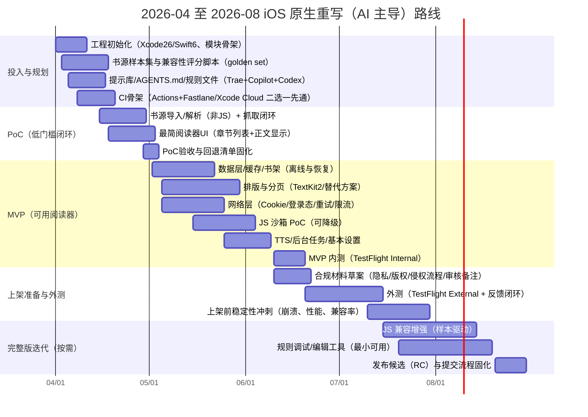

# Legado 书源兼容的 iOS 原生重写（方案 C）AI 主导可执行启动方案

**执行摘要（≤6行）**  
本方案以“原生重写核心能力、兼容 Legado 书源 JSON 规则、但不复用 Android 代码”为前提，给出可立即启动的分阶段路线与低门槛 PoC。  
从 2026-04-28 起，上传到 App Store Connect 的 iOS 应用需使用 **iOS 26 SDK / Xcode 26+**，但依然可以把部署目标设为 **iOS 15+**（Xcode 26 支持 iOS 15–26 的 deployment target）。citeturn0search6turn0search13turn0search19  
Legado 书源生态的难点集中在：HTML 解析、XPath/JSONPath、**JS 规则/JS 扩展**、Cookie/登录态、以及其内置 Web 服务与 WebSocket 调试接口。citeturn7view0turn0search4turn12view0  
采用 Copilot/Codex/Trae 的 AI 主导模式可显著降低样板代码与“试错实现”成本，但必须用 **AGENTS.md/规则文件 + 测试基线 + PR 审视清单** 来抵御安全/并发/合规风险与回退成本。citeturn2search2turn4search1turn4search3  
推荐先做“**非 JS 规则 MVP** + **JS 沙箱 PoC**（可降级）”，以可控方式逐步提高兼容率，并在 App Review Notes 中解释脚本策略以降低 2.5.2 拒审风险。citeturn18view0

## 约束与总体策略

本节先把“必须遵守的外部约束”和“Legado 兼容带来的工程约束”讲清楚，便于你用 vibe coding 方式稳态推进。

**未指定假设（需在项目启动会上落地）**：团队规模=未指定；预算=未指定；现有 CI/证书体系=未指定；是否有法务/版权顾问=未指定；目标市场/上架国家地区=未指定；书源样本规模=未指定。

**上架工具链硬约束（时间敏感）**  
自 2026-04-28 起，上传到 App Store Connect 的 iOS/iPadOS 应用需要使用 iOS 26 SDK 或更高版本（通常意味着 Xcode 26+）。citeturn0search6turn0search13  
同时，Xcode 26 的系统要求页面显示：Xcode 26 运行在 macOS Sequoia 15.6+，并支持 iOS 15–26 的 deployment target；其编译器支持 Swift 6（示例行中可见 Swift 6.2）。citeturn0search19  
因此，“入手难度低”的稳妥路径是：**构建环境跟随 Xcode 26（满足提交流水线），应用最低支持先取 iOS 15+**；若你强烈需要 iOS 13+，它将与 Xcode 26 的上传支持区间发生冲突，需要额外策略（例如另建分支/历史 Xcode 构建用于企业分发而非 App Store），但这已超出“低门槛启动”的范畴。citeturn0search19turn0search6  

**Legado 书源兼容的工程约束（从官方仓库读到的信号）**  
Legado 的 Android 工程依赖中直接出现 `jsoup`、`json-path`、`JsoupXpath`（XPath）、以及 `nanohttpd`/`nanohttpd-websocket`（本地 Web 服务与 WebSocket），同时还有一个 Rhino JS 模块工程（`modules:rhino1.7.3`），这些共同指向：**书源规则不仅是简单 JSON，还可能包含 XPath/JSONPath/JS 执行与调试能力**。citeturn7view0turn7view1  
官方 `api.md` 也明确了其 Web 服务（示例端口 1234）以及 WebSocket 调试/搜索等接口（示例端口 1235）。citeturn0search4  
仓库 `modules/web/README.md` 说明“阅读 web 端”使用 Vue3，且在开发模式下“需要阅读 app 提供后端服务”。这意味着如果你希望复刻其 web 端书架/源编辑体验，iOS 侧要么实现类似后端 API，要么提供替代方案。citeturn7view2  
此外，`BookSource.kt` 里的字段（如 `jsLib`、请求 `header`、`loginUrl`/`loginUi`、`enabledCookieJar`、并发 `concurrentRate`、以及 `ruleSearch/ruleToc/ruleContent` 等规则子结构）给了你“兼容层定义”的直接参照：iOS 重写最好建立**一份与该 JSON schema 对齐的 Codable 模型，并保留未知字段以免未来规则扩展造成崩溃**。citeturn12view0turn0search4  

**内容与版权定位（上架风险的基座）**  
Legado 的说明文档强调“软件不提供内容，需要用户自行导入书源”等含义；你的 iOS 应用若要降低审核/合规风险，必须在产品与审核说明中明确同样立场，并提供侵权投诉/下架流程。citeturn6search7  

**“干净房间”原则与 GPL 污染风险**  
Legado 仓库包含 GNU GPL v3 许可文本；在“方案 C（不复用 Android 代码）”前提下，你的关键是：**不复制其实现代码、也避免让 AI 直接改写/翻译其代码片段进入 iOS 仓库**，仅以公开 JSON 规则与行为黑盒测试实现兼容。citeturn16view0  
这对 vibe coding 很关键：你要把“不可引用的材料”写入提示库与审查清单（见后文），并在 PR 中强制要求可追溯的设计说明与测试证据。

**App Store 审核底线：动态代码与脚本执行**  
App Review Guidelines 2.5.2 明确禁止应用下载/安装/执行会引入或改变功能的代码（教育类等有限例外）。citeturn18view0  
因此，凡是“书源里带 JS 并在客户端执行”的设计，必须做到：不下载可执行二进制、不动态加载改变功能的代码；并将 JS 限制为**规则解释器的一部分（固定在 App 包内）**，且提供强沙箱与降级策略（详见后文）。citeturn18view0turn3search5  

## 分阶段开发方案

这里给你一个“能立刻开干”的阶段划分，并把每阶段的交付物与验收标准写成可贴到 GitHub Projects/Issues 的模板。

### 阶段划分、目标、交付物与验收标准

| 阶段 | 目标范围（入手难度优先） | 关键交付物 | 验收标准（可量化） |
|---|---|---|---|
| 投入与规划 | 建立“干净房间 + AI 主导”工程底座；明确 iOS 15+ 基线 | 新 iOS 仓库骨架、依赖策略、AGENTS.md、提示库、样本书源集、CI 骨架 | 1）Xcode 26 可编译运行；2）CI 能跑静态检查+单测；3）样本集与兼容性评分脚本可运行 |
| 低门槛 PoC | 证明“导入书源 JSON → 搜索/目录/正文抓取 → 阅读显示”可闭环（先不做 JS） | PoC App + 解析引擎最小子集 + 10 个非 JS 样本 | 1）10/10 样本能完成“搜索→打开章节→显示正文”；2）崩溃率=0；3）正文加载 P95 < 2s（Wi‑Fi） |
| MVP（非 JS 优先） | 做到可用阅读器：书架、缓存、基本排版、TTS；JS 规则“可识别/可提示/可降级” | TestFlight 内测包、核心数据模型、网络层、缓存、阅读器、导入/导出 | 1）样本集（建议 ≥50 非 JS）兼容率 ≥70%；2）关键路径单测覆盖率 ≥60%；3）日志可定位失败原因 |
| Beta 与上架准备 | 外测与合规材料完善；解释书源/脚本策略；降低拒审风险 | 外测包、隐私与版权文档、App Review Notes、侵权投诉流程、崩溃监控 | 1）外测 build 通过 TestFlight 审核（如需）；2）隐私“营养标签”填写完成；3）审核备注包含脚本与内容策略 |
| 完整版迭代 | 提升 JS 兼容率、规则调试/编辑体验、同步/多端等（按你需求） | JS 沙箱增强、规则调试工具、兼容矩阵扩展 | 1）JS 样本兼容率目标（如 ≥50%→≥80%）；2）安全测试通过（沙箱逃逸/资源滥用） |

TestFlight 外部测试可能需要 App Review，且在 App Store Connect 中首次将 build 加入外部测试组时会送审。citeturn4search2turn4search12  

### 传统开发 vs AI 主导开发估算

基于你给定的基线（传统 MVP 8–14 人月，完整版 18–30 人月），并结合“AI 主导模式的新增开销（提示库、审视、回退）”，给出一套可用于预算讨论的**两轨估算**（所有金额均为估算；团队规模/人力单价/范围未指定会显著影响最终数值）。

| 维度 | 传统开发（基线） | AI 主导（Copilot/Codex/Trae 为主 + 你审视） | 关键解释 |
|---|---:|---:|---|
| MVP 人月 | 8–14 | 6–11 | AI 对样板代码、UI 拼装、测试样例生成、文档草稿能显著提速；但引入“审视/回退/安全加固”成本 |
| MVP 日历周期 | 2.5–4 个月 | 2–3.5 个月 | 典型缩短 15%–30%，取决于你审视投入与 CI 完备度 |
| 完整版人月 | 18–30 | 14–24 | JS 兼容与沙箱、规则调试工具通常是长尾；AI 仍能提速但收益递减 |
| 完整版周期 | 4–7 个月 | 3.5–6 个月 | 典型缩短 10%–25% |
| 质量风险溢价 | 低–中 | 中–高（早期） | AI 容易在并发、内存、边界条件、合规细节上“看似可用但不可控” |
| 成本（RMB，粗略） | 取决于人月单价 | 人月成本下降 + 订阅成本上升 | 订阅相对人力通常是小头，但需要计入 |

> 建议把“AI 主导减人月”当作**目标区间**而不是承诺：前 4–6 周往往会被“提示工程+测试基线+兼容性样本集建设”吃掉一部分收益。citeturn2search2turn4search0  

### 三到六个月详细甘特图（含 AI 驱动活动）



**里程碑验收标准（建议写入 GitHub Milestones）**  
PoC 里程碑：至少 10 个非 JS 样本闭环通过；失败必须可解释（日志/错误码/可复现）。  
MVP 里程碑：≥50 个非 JS 样本兼容率 ≥70%；关键路径（导入→搜索→阅读）自动化回归全绿；TestFlight 内测可安装可用。citeturn4search2turn4search16  
外测里程碑：外测 build 进入外部组并完成 TestFlight 所需“测试信息”（如适用）。citeturn4search16turn4search19  

## 最小可行入手路径

这一节把“第一次动手要做什么”压到最低门槛，适合你以 vibe coding 方式带着 AI 直接开工。

### 最少人员、工具、订阅与时间

**最少人员配置（未指定团队规模条件下的最低可行）**  
1 名 iOS 全栈工程师（能独立完成网络/数据/基础 UI）+ 你（审视方，负责验收与提示库/测试基线/合规边界）。团队规模=未指定。

**必需工具链**  
Xcode 26（满足 2026-04-28 起提交流水线要求），且需要 macOS Sequoia 15.6+。citeturn0search19turn0search6  
若你希望使用 GitHub Copilot for Xcode，GitHub 文档写明需要 Xcode 8+、macOS Monterey 12+（你在 Xcode 26 环境下自然满足）。citeturn2search4  

**建议的最小 AI 订阅组合（RMB/月，估算）**  
以下按 **1 USD≈7 RMB（未指定汇率，仅估算）** 折算：

- Copilot：Pro（300 premium requests/月）或 Pro+（1500/月）；额外 premium request 计费 $0.04/次。citeturn0search7turn0search11turn0search14  
- Codex：可以通过 ChatGPT Plus/Pro 等计划使用；Codex 定价页给出了不同计划的 usage limits 与 credits 机制。citeturn8view2turn1search0  
- Trae：按 $3/$10/$30/$100 四档计费（且有 14 天 Pro 试用的描述），用于“规则/上下文/提示管理”。citeturn1search6turn1search2turn4search3  
- ChatGPT（用于 Codex 与设计/审查）：Go $8、Plus $20、Pro $200（月付），官方公告中明确。citeturn11search2turn11search3turn11search1  

**时间**  
低门槛 PoC：10–15 个工作日（约 2–3 周）。  
前提是：你愿意先“只兼容非 JS 规则”，把 JS 作为独立 PoC 与后续迭代目标。

### 低门槛 PoC 的范围定义

PoC 的目标不是“好用”，而是“闭环 + 可测 + 可扩展”，因此范围要刻意克制：

- 书源导入：读取一份 `BookSource` JSON（先对齐 Legado 主要字段，如 url/name/group/header/loginUrl/enabledCookieJar、以及 ruleSearch/ruleToc/ruleContent）。citeturn12view0  
- 引擎闭环：对 10 个非 JS 书源样本实现“搜索→目录→正文抓取”，并把结果落到本地缓存（任意简单形式即可）。  
- 阅读呈现：正文用最简 UI 展示（允许先不做分页/主题/字体）。  
- 失败可解释：对每次解析失败输出结构化日志（错误码 + 阶段 + 规则字段 + 目标 URL）。

验收时，你只问四个问题：能跑吗？能复现吗？能定位吗？能扩展吗？

## 准备工作清单

在 AI 主导项目里，“准备工作”决定了后续 80% 的效率与质量；缺了这些，vibe coding 会变成“vibe 返工”。

### 仓库与文档资产

建议在新 iOS 仓库里一次性建立这些文件（都属于低门槛但高回报）：

- `AGENTS.md`：写清楚代码风格、目录结构、测试命令、禁止事项（如禁止复制 Legado 代码）。Codex 官方明确将 AGENTS.md 作为可复用的 agent 指南。citeturn2search2turn19search0  
- `.github/agents/*.agent.md`：把“实现/测试/安全审查/性能审查/合规材料生成”拆成不同 agent persona。GitHub 文档说明 custom agents 的 agent profile（`.agent.md`）位置与格式。citeturn4search1turn4search5  
- `.trae/`：如果你用 Trae，把项目规则与索引忽略写入（Trae 提供 Rules、Skills、Codebase indexing 相关文档）。citeturn4search0turn4search3turn4search4  

### 书源样本集与“可回归”测试基线

建议你在 PoC 前就建立“golden set”，否则兼容性会失控：

- `samples/booksource/non_js/`：至少 50 个（未指定时先 20 个起步）  
- `samples/booksource/with_js/`：至少 20 个（用于后续 JS 沙箱迭代）  
- `fixtures/http/`：抓取到的 HTML/JSON 响应离线保存（用于稳定回归，避免依赖目标站点变动）  
- `compat_matrix.yml`：将样本标注为“必须支持/可降级/可忽略”，并记录失败原因分类

同时写一个脚本（Swift Package 或命令行）跑“样本→解析→输出 JSON 结果→与期望比对”。

### 合规材料草案与审核沟通素材

你不需要一开始就写得完美，但必须提前起草：

- 隐私政策（包含：数据类型、用途、保留期、第三方 SDK、用户权利）  
- 用户协议 & 内容来源声明（强调：不提供内容、用户导入书源）citeturn6search7  
- 侵权投诉/下架流程（邮箱/工单、处理时限、证据要求）  
- App Review Notes 草案：解释“书源规则解析/脚本执行/降级策略”，对照 2.5.2 风险点逐条澄清。citeturn18view0  
- TestFlight 外测计划：外测组、设备/系统要求、测试用例、以及 App Store Connect 要求填写的测试信息。citeturn4search16turn4search19  

## AI 驱动工作流与审视方操作手册

你要做的不是“写每一行代码”，而是把 AI 的产出变成可控工程：可追溯、可回归、可审计。

### 将 Trae/Codex/Copilot 分工到“最适合的环节”

- Copilot（Xcode 内）：适合 UI/模型/样板代码、重构、局部修复；并可通过 coding agent 机制在 GitHub 上“分配 issue → 自动开 PR”。citeturn2search4turn19search4turn19search1  
- Codex（偏“任务制”与“审查制”）：适合生成成段功能、补测试、以及 PR code review；GitHub 集成支持 `@codex review` 与自动 reviews，并会参考 AGENTS.md。citeturn19search0turn19search2turn2search2  
- Trae（偏“规则/上下文/提示工程”）：适合维护项目 constitution（规则文件）、管理被索引上下文、以及沉淀可复用技能。citeturn4search0turn4search3turn4search4  

### 你的“vibe coding 审视 PR”步骤化流程

把下面流程当成“每个 PR 必走”：

1. **先看 Issue 验收标准**：PR 必须引用对应 issue，并逐条回应验收点（否则让 AI 补充说明）。  
2. **看变更范围是否越界**：是否引入额外依赖、是否改动 CI/Workflow、是否触碰脚本执行与安全策略。  
3. **跑最小回归**：本地一键脚本跑：单测 + golden set 解析 + 启动关键路径 UI 测试（哪怕是最简）。  
4. **检查并发与资源上限**：网络并发、JS 执行时间、内存峰值是否设置了硬上限与超时。  
5. **检查“干净房间”与许可**：PR 描述必须说明“无 Legado 代码拷贝”，新增依赖必须列出 license。  
6. **合并前锁定回退策略**：如上线后出现兼容崩溃，能否通过 feature flag 关闭 JS、关闭某类规则、或回滚到上一个构建。

Copilot coding agent 属于“可推代码的自治 agent”，GitHub 官方也明确了其风险与缓解（例如未验证代码引入漏洞、对敏感信息的风险、prompt injection 等），因此你要把上述流程当成强制门禁。citeturn2search1turn2search12  

### Prompt 模板示例（可直接进提示库）

**通用实现 Prompt（给 Copilot Chat / Codex）**  
- 角色：资深 iOS 工程师（Swift 6 / iOS 15+）  
- 约束：只用 SPM；禁止引入新依赖（除非 issue 允许）；禁止参考/翻译 Legado Android 代码；必须加单测；必须更新文档  
- 输出：先给计划（文件列表 + 变更点 + 风险），再提交实现

**兼容性任务 Prompt（样本驱动）**  
- 输入：`samples/booksource/non_js/xxx.json` + 对应离线 HTML fixtures  
- 目标：让该样本从“失败原因 A”变为“通过”，并新增回归用例  
- 降级：若必须 JS，则先实现“可识别并提示 + 不崩溃”的降级路径

**PR 审查 Prompt（用 Codex review 或 Copilot review agent）**  
- “请按安全/并发/隐私/性能/可维护性 5 维度评分，每项 0–3；列出必须修复的 P0/P1；给出可运行的测试补丁。”

Codex 文档明确建议复杂任务先 plan，并把可复用指导写入 AGENTS.md。citeturn2search2turn19search0  

## 关键技术实现要点与低难度替代

本节不追求“最强实现”，而追求“最先跑通 + 后续可加固”。

### JS 沙箱 PoC（低难度版本）

**为什么必须先做“可降级 PoC”**  
Legado 侧显式引入 Rhino 模块（Android 环境），且书源模型里有 `jsLib`、登录检测 JS、封面解密 JS 等字段，说明 JS 在生态中并非边缘能力。citeturn7view0turn7view1turn12view0  
但 iOS 上执行用户提供脚本会触发 2.5.2 风险点，你需要把 JS 变成“受控解释器”，并优先保证“不会变成功能动态扩展”。citeturn18view0turn3search5  

**PoC 策略（推荐从严到宽逐步开放）**  
- 默认关闭 JS 执行；遇到含 JS 规则：提示“该书源使用脚本规则，当前版本降级运行”。  
- 使用 JavaScriptCore 作为固定内置引擎（App 包内），并对每次执行设置：超时、最大输出大小、禁止网络/文件 API 暴露、限制可调用的桥接函数集合。JavaScriptCore 是 Apple 提供的框架，官方文档描述其用于在 Swift/Obj‑C 应用内评估 JS。citeturn3search5turn3search1  
- 逐步开放“白名单 API”：只提供纯函数（字符串/正则/哈希/解码等），避免提供能改变 App 功能面的接口。

> 关键点：任何从网络下载的脚本库都可能被审核认为“下载并执行引入功能的代码”。因此建议把规则需要的“标准库”固化在 App 内，书源仅能调用既有 API。citeturn18view0  

### HTML / XPath / JSONPath 的低门槛选型

Legado 在 Android 侧使用 jsoup、JsoupXpath、json-path。citeturn7view0  
iOS 原生重写建议先选“社区成熟 + SPM 友好 + 许可清晰”的库，以便 AI 更容易生成可用代码与测试。

- HTML 解析（CSS Selector）：SwiftSoup（纯 Swift、跨平台、MIT）。citeturn15search0turn15search4  
- XPath：Kanna（XML/HTML parser，支持 XPath，MIT，且文档展示了 SPM 安装方式）。citeturn15search1turn15search25  
- JSONPath：如果你要低门槛，优先“先不引入库”——用 `Codable + 手写 keyPath（点号路径）` 支撑 PoC；后续再引入 JSONPath 库（否则早期容易陷入边界兼容泥潭）。

建议你的“解析引擎”内部抽象成统一接口：`select(html, selectorType, expr)`，把 CSS/XPath/JSONPath 都包装成同形 API，便于后续替换与兼容层打补丁。

### 阅读器内核：先抓住 TextKit2 的性能红利

阅读器最大的性能风险是“长文本布局与滚动”。WWDC21 介绍 TextKit2 使用 viewport‑based layout 来提升性能，并且 iOS 15 起 UIKit 中可用。citeturn3search26turn3search2  
低门槛建议：  
- MVP：先用 `UITextView` 或自定义 `UIScrollView + CATextLayer/NSAttributedString` 贴合基本样式（最少功能）。  
- 需要性能再切换：用 TextKit2 组件（`NSTextLayoutManager` 等）实现更可控的排版与分段渲染。citeturn3search2turn3search26  

### Cookie/登录态：WKWebView 与 URLSession 的“分离现实”

Apple 文档指出：WKWebView 的 cookie 存储与共享 cookie storage 并不等同；WKWebView 有自己的 cookie 存储，而传统共享 cookie storage 是另一套。citeturn3search0turn3search14  
Apple 开发者论坛也明确提到 WKWebView 的 cookie 同步在旧平台上很棘手，并给出通过 request header 或在 webview 内执行 JS（document.cookie）等思路。citeturn3search4  

低门槛策略：  
- **PoC 不引入 WKWebView**：尽量用 `URLSession` 抓取与解析，避免 cookie 双栈同步地狱。  
- 若必须登录（例如书源依赖登录态）：先实现“URLSession cookie jar（HTTPCookieStorage）”与持久化，再评估是否需要 WKWebView 承接交互式登录。citeturn3search0turn3search4  

### 本地服务是否必须：优先不做，除非你要复刻其 Web 端生态

Legado 的 Android 依赖中明确有 `nanohttpd` 与 `nanohttpd-websocket`，且 `api.md` 提供了 HTTP 与 WebSocket 的调试接口；这解释了其 web 端与调试工具为何能工作。citeturn7view0turn0search4  
同时，`modules/web/README.md` 写明 web 端开发需要阅读 app 提供后端服务。citeturn7view2  

**低门槛建议**  
- MVP：不做本地 HTTP server；把“调试与规则编辑”做成 App 内页面（最少功能即可）。  
- 若你必须支持“配套 web 源编辑器”：可选嵌入式 HTTP server（例如 GCDWebServer，面向 iOS 嵌入 HTTP 1.1 server，且有 BSD license 信息）。citeturn15search2turn15search36  
- WebSocket：优先用 SwiftNIO（Apple 的 SwiftNIO 是跨平台异步网络框架），其仓库包含 WebSocket server 示例模块。citeturn15search15turn15search3  

## CI/CD 与发布自动化

你要的目标是：“AI 写代码 → 自动跑测试 → 自动打包 → TestFlight 分发”，并且在这个链路上留足安全门禁。

### 两条低门槛路线：GitHub Actions + Fastlane 或 Xcode Cloud

- Xcode Cloud：Apple 文档提供“构建用于分发的 workflow”与 workflow 配置参考，适合偏 Apple 原生体系。citeturn3search3turn3search27turn3search13  
- GitHub Actions + Fastlane：更适合与你的 Copilot/Codex 生态结合；Fastlane `upload_to_testflight` 与 iOS beta deployment 文档较完整。citeturn2search3turn2search19turn2search31  

### 代码签名与密钥管理（低门槛但不能省）

- GitHub 提供“在 macOS runner 安装 Apple 证书”的官方指南。citeturn14search0  
- Fastlane 的 match 用于团队共享签名身份（证书与 profile）。citeturn14search2turn14search6  
- App Store Connect API Key 的创建步骤有 Apple 官方文档；Fastlane 也提供 App Store Connect API 的配置说明。citeturn14search11turn14search3  

### AI 与 CI 的关键门禁点

如果你使用 Copilot coding agent：它会创建 PR 请求你 review；并且 GitHub 文档提示，默认情况下 Copilot 推送的 PR 不会自动运行 Actions，需要显式批准或配置自动运行（但自动运行有泄露 secrets 风险）。citeturn19search4turn19search3  
因此低门槛建议：  
- **前两个月坚持“人工批准后运行 workflows”**；  
- workflows 里将“上传 TestFlight（需要密钥）”与普通测试 jobs 分离，避免未经审视的 PR 触碰发布密钥。

### GitHub Actions + Fastlane 伪代码示例

```yaml
# .github/workflows/ios-ci.yml (伪代码示例)
name: iOS CI

on:
  pull_request:
  workflow_dispatch:

jobs:
  test:
    runs-on: macos-latest
    steps:
      - uses: actions/checkout@v4
      - name: Select Xcode 26 (示意)
        run: sudo xcode-select -s /Applications/Xcode_26.app
      - name: Build & Unit Tests
        run: |
          xcodebuild -scheme ReaderApp \
            -destination "platform=iOS Simulator,name=iPhone 16" \
            test

  beta:
    # 强烈建议：仅 main 分支、且需要人工批准/环境保护（伪代码）
    if: github.ref == 'refs/heads/main'
    needs: [test]
    runs-on: macos-latest
    environment: testflight
    steps:
      - uses: actions/checkout@v4
      - name: Install signing certs (示例参考 GitHub 官方文档)
        run: ./ci/install_certs.sh
      - name: Fastlane upload to TestFlight
        run: bundle exec fastlane beta
        env:
          ASC_KEY_ID: ${{ secrets.ASC_KEY_ID }}
          ASC_ISSUER_ID: ${{ secrets.ASC_ISSUER_ID }}
          ASC_KEY_CONTENT: ${{ secrets.ASC_KEY_CONTENT }}
```

`upload_to_testflight` 的 Fastlane action 文档与 iOS beta deployment 指南可直接作为落地参考。citeturn2search3turn2search19  
App Store Connect API 的创建与 Fastlane 接入也可参考各自文档。citeturn14search11turn14search3  

### 将 Codex/Copilot 接入 PR 自动化（低门槛做法）

- Codex：GitHub 集成支持在 PR 评论中 `@codex review` 请求审查，也支持开启 automatic reviews；并会参考最近的 AGENTS.md。citeturn19search0  
- Copilot：支持“分配 issue 给 Copilot → 自动开 PR”，官方文档说明了该流程与注意事项。citeturn19search1turn19search7  

你可以把“兼容性样本失败”自动转为 issue，然后由 Copilot/Codex 轮转修复，但务必把 golden set 回归跑在 PR 门禁上。

## 预算、风险与量化目标

### 预算与订阅建议（RMB/月，估算）

**汇率假设未指定**：以下按 1 USD≈7 RMB 估算，仅用于量级讨论。

- GitHub Copilot：官方页面列出 Free/Pro/Pro+ 的 premium request 配额，并可按 $0.04/次购买额外 premium requests。citeturn0search7turn0search14  
  - Pro：约 70 RMB/月  
  - Pro+：约 270 RMB/月  
- OpenAI（用于 Codex/规划/审查）：官方公告给出 Go $8、Plus $20、Pro $200 的月费；Codex pricing 页给出 usage limits 与 credits 机制。citeturn11search2turn11search3turn11search1turn8view2  
  - Go：约 56 RMB/月；Plus：约 140 RMB/月；Pro：约 1400 RMB/月  
- Trae：官方定价页显示 $3/$10/$30/$100 四档。citeturn1search6  
  - Lite/Pro/Pro+/Ultra：约 21/70/210/700 RMB/月  

**推荐组合（低门槛启动）**  
- 你本人（审视方）：ChatGPT Plus + Copilot Pro+（或 Pro）  
- iOS 工程师：Copilot Pro+（Xcode 内高频使用）  
- Trae：先 Lite/Pro 试用，用来沉淀规则与上下文管理；如果效果一般可后续替换（AI 依赖风险见下）。

> 重要：从 2026-04-24 起，GitHub 文档提示 Copilot Free/Pro/Pro+ 可能使用你的交互数据用于训练与改进；Business/Enterprise 不用于训练，且个人可在设置中 opt‑out。若你对代码/规则高度敏感，建议优先评估 Business/Enterprise 或强制 opt‑out 并做定期审计。citeturn13search1turn13search6  

### 风险清单与缓解措施（含量化指标）

**技术风险：并发/内存/性能**  
- 风险：AI 生成代码常在取消任务、错误传播、资源释放（如定时器/任务）上不严谨，PoC 阶段容易“能跑但不稳”。  
- 缓解：关键路径强制单测 + 解析引擎 fuzz（输入畸形 HTML/JSON）；引入 P95 延迟与内存峰值监控。  
- 指标：崩溃率=0（内部）；章节加载 P95 < 2s（Wi‑Fi）；兼容性回退率（见后）≤15%。

**合规风险：脚本执行与 2.5.2**  
- 风险：执行用户提供 JS 可能被解释为“执行改变功能的代码”。citeturn18view0  
- 缓解：JS 引擎固定内置；脚本能力白名单；超时/资源限额；在 App Review Notes 明确“脚本仅用于解析网页内容、不会加载新功能模块”。citeturn18view0turn3search5  
- 指标：JS 规则默认降级可用；沙箱超时触发率 < 1%；无网络/文件逃逸用例（安全测试通过）。

**版权与运营风险：内容来源与侵权投诉**  
- 风险：即便“用户导入书源”，仍可能被投诉为聚合侵权内容。  
- 缓解：清晰声明“不提供内容”；提供屏蔽/黑名单；建立侵权投诉邮箱与处理 SLA；保留审计日志（仅限必要信息）。citeturn6search7  
- 指标：投诉处理 SLA（例如 72 小时初步响应、7 天内处理结论）；可一键禁用被投诉书源域名。

**AI 依赖风险：供应商策略变化/数据政策变化**  
- 风险：模型能力与计费策略会变；Copilot 的数据使用政策对个人订阅有变化窗口。citeturn13search1turn0search7  
- 缓解：把提示库、测试基线、兼容矩阵当作“可迁移资产”；每月做一次“模型替换演练”（同一任务分别用 Copilot/Codex/Trae 跑通）。  
- 指标：关键任务“单一供应商依赖度”≤50%；提示库命中率（复用）≥60%。

**质量回退率（你最需要盯的一个指标）**  
- 定义：合并后因兼容/崩溃/性能问题需要 revert 的 PR 占比。  
- 目标：PoC 阶段 ≤25%；MVP 阶段 ≤15%；上架前 ≤10%。

### 主要参考链接（可点击）

- App Store Connect 提交的 iOS 26 SDK/Xcode 要求（2026-02-03 公告与提交说明页）。citeturn0search6turn0search13  
- Xcode 26 系统要求（macOS Sequoia 15.6+、iOS 15–26 deployment target、Swift 6）。citeturn0search19  
- App Review Guidelines 2.5.2（下载/安装/执行代码限制）与 2.5.6（浏览网页须用 WebKit）条款。citeturn18view0  
- Legado 官方仓库关键文件：`api.md`（Web 服务与 WebSocket 调试端口/接口）。citeturn0search4  
- Legado `app/build.gradle`（jsoup/json-path/XPath/Rhino/nanohttpd 等依赖信号）。citeturn7view0  
- Legado `modules/rhino/build.gradle`（Mozilla Rhino 等 JS 依赖）。citeturn7view1  
- Legado `modules/web/README.md`（web 端依赖 app 后端服务）。citeturn7view2  
- Legado `BookSource.kt`（书源字段与规则子结构参考）。citeturn12view0  
- Legado LICENSE（GPLv3，提示“干净房间”必要性）。citeturn16view0  
- OpenAI：ChatGPT Go/Plus/Pro 官方价格说明。citeturn11search2turn11search3turn11search1  
- OpenAI：Codex pricing（usage limits/credits）与 GitHub 集成（`@codex review`/自动 reviews/AGENTS.md）。citeturn8view2turn19search0  
- OpenAI：Codex best practices（AGENTS.md/先 plan）。citeturn2search2  
- GitHub Copilot：计划与 premium requests（含 $0.04/次），以及 coding agent 能力与风险/门禁。citeturn0search7turn2search1turn19search3turn19search7  
- GitHub Copilot：个人订阅数据用于训练的政策说明（2026-04-24 生效、可 opt‑out；Business/Enterprise 不用于训练）。citeturn13search1turn13search6  
- Trae：官方定价与 Rules/Skills/Codebase indexing 文档入口。citeturn1search6turn4search20turn4search0turn4search3  
- TextKit2：WWDC21 “Meet TextKit 2” 与 `NSTextLayoutManager` 文档。citeturn3search26turn3search2  
- JavaScriptCore：官方框架文档（iOS 内评估 JS）。citeturn3search5turn3search1  
- Cookie：HTTPCookieStorage 与 WKHTTPCookieStore 文档/论坛讨论（解释双栈问题）。citeturn3search0turn3search14turn3search4  
- Fastlane：`upload_to_testflight` 与 beta deployment 文档；GitHub Actions：安装 Apple 证书的官方指南。citeturn2search3turn2search19turn14search0